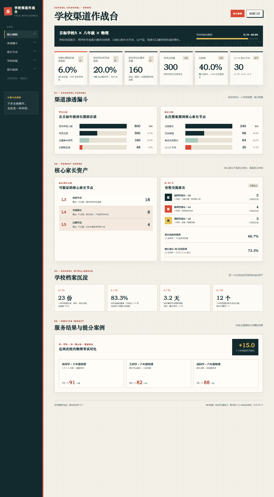

# 学校渠道作战台

用于展示单所目标学校渠道建设进展的电脑端管理看板。当前版本是无需安装、无需构建的静态演示页，面向分校校长和学校攻坚小组。

代码仓库：<https://github.com/zhipeng-yu/Intelligence-System>



## 使用方法

直接双击 [`index.html`](index.html)，使用最新版 Edge 或 Chrome 打开即可。

页面右上角的“数据口径”用于查看指标定义；“多校对比”目前仅保留入口，尚未接入功能。

## 当前内容

页面固定演示“目标学校A × 八年级 × 物理”，包含五个模块：

1. 核心指标：长期班渗透率、学员渗透率、去重学员量、注册量、加微率和L3–L5家长数。
2. 渗透漏斗：分别展示学生转化和家长关系，避免混用人数口径。
3. 家长节点：展示L3信息节点、L4共创家长、L5口碑节点及有效交流。
4. 学校档案：展示试卷、档案完整度、情报更新周期和诊断活动方案。
5. 提分案例：展示匿名学生在可比校内考试中的成绩变化和对应服务动作。

所有姓名和业务数字均为演示信息。

## 指标口径

| 指标 | 计算方式 | 演示值 |
| --- | --- | --- |
| 长期班在读渗透率 | 长期班在读学生 ÷ 目标年级学生 | 48 ÷ 800 = 6.0% |
| 目标学校学员渗透率 | 跨活动、短期班和长期班去重后的学生 ÷ 目标年级学生 | 160 ÷ 800 = 20.0% |
| 加微率 | 已加微信去重家长 ÷ 已注册去重家长 | 96 ÷ 240 = 40.0% |
| 核心家长30日活跃率 | 近30日产生有效互动的L3–L5家长 ÷ L3–L5家长 | 22 ÷ 30 = 73.3% |
| 有效提分案例 | 同学科、同满分制、难度相近的两次校内考试提升至少10分 | 3例，平均提升15分 |

学生指标只使用学生人数，家长指标只使用去重家长人数，两种口径不得混算。

## 项目结构

```text
.
├── index.html                  # 页面、样式、演示数据和交互
├── readme.md                   # 使用说明
├── handoff.md                  # 当前状态与后续交接
├── AGENTS.md                   # 后续开发约束
└── artifacts/
    ├── dashboard-desktop.png   # 1920宽桌面截图
    └── dashboard-fullpage.png  # 完整页面截图
```

## 当前边界

- 只支持单校演示，不读取真实业务数据。
- 暂无Excel导入、后台、账号、权限或在线编辑。
- 以电脑浏览器为验收环境，不承诺手机端体验。
- 页面数据直接写在 `index.html` 中，修改数字时必须同步检查公式和“数据口径”弹窗。

下一阶段建议先确定标准Excel字段，再实现人工导入；有至少两所真实目标学校后，再建设多校对比。

## 发布约定

项目变更完成并验证后，精简更新 `readme.md`、`handoff.md` 和 `AGENTS.md`，然后直接推送远端 `main`。三份文档只保留当前有效信息，避免重复内容污染上下文；没有文件变化时不创建空提交。
